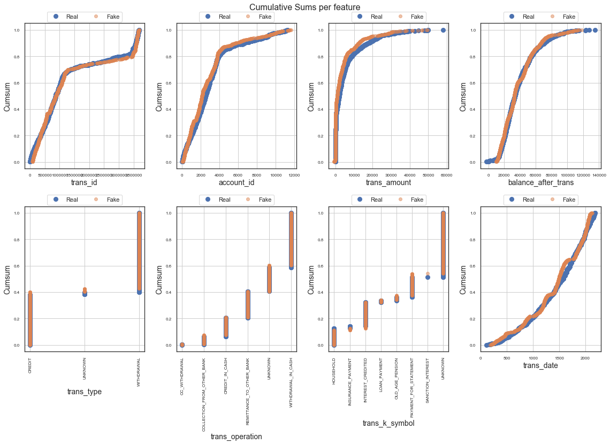

# TableEvaluator
[](https://badge.fury.io/py/table-evaluator)

TableEvaluator is a library to evaluate how similar a synthesized dataset is to a real data. In other words, it tries to give an indication into how real your fake data is. With the rise of GANs, specifically designed for tabular data, many applications are becoming possibilities. For industries like finance, healthcare and goverments, having the capacity to create high quality synthetic data that does **not** have the privacy constraints of normal data is extremely valuable. Since this field is this quite young and developing, I created this library to have a consistent evaluation method for your models.

## Installation
The package can be installed with
```
pip install table_evaluator
```

## Usage
Start by importing the class
```Python
from table_evaluator import *
```

The package is used by having two DataFrames; one with the real data and one with the synthetic data. These are passed to the TableEvaluator on init.
The `helpers.load_data` is nice to retrieve these dataframes from disk since it converts them to the same dtypes and columns after loading. However, any dataframe will do as long as they have the same columns and data types.

 Using the test data available in the `data` directory, we do:

```python
real, fake = load_data('data/real_test_sample.csv', 'data/fake_test_sample.csv')

```
which gives us two dataframes and specifies which columns should be treated as categorical columns.

```python
real.head()
```


| trans_id | account_id | trans_amount | balance_after_trans | trans_type | trans_operation            | trans_k_symbol    | trans_date |
|----------|------------|--------------|---------------------|------------|----------------------------|-------------------|------------|
| 951892   | 3245       | 3878.0       | 13680.0             | WITHDRAWAL | REMITTANCE_TO_OTHER_BANK   | HOUSEHOLD         | 2165       |
| 3547680  | 515        | 65.9         | 14898.6             | CREDIT     | UNKNOWN                    | INTEREST_CREDITED | 2006       |
| 1187131  | 4066       | 32245.0      | 57995.5             | CREDIT     | COLLECTION_FROM_OTHER_BANK | UNKNOWN           | 2139       |
| 531421   | 1811       | 3990.8       | 23324.9             | WITHDRAWAL | REMITTANCE_TO_OTHER_BANK   | LOAN_PAYMENT      | 892        |
| 37081    | 119        | 12100.0      | 36580.0             | WITHDRAWAL | WITHDRAWAL_IN_CASH         | UNKNOWN           | 654        |


```python
fake.head()
```

| trans_id | account_id | trans_amount | balance_after_trans | trans_type | trans_operation            | trans_k_symbol | trans_date |
|----------|------------|--------------|---------------------|------------|----------------------------|----------------|------------|
| 911598   | 3001       | 13619.0      | 92079.0             | CREDIT     | COLLECTION_FROM_OTHER_BANK | UNKNOWN        | 1885       |
| 377371   | 1042       | 4174.0       | 32470.0             | WITHDRAWAL | REMITTANCE_TO_OTHER_BANK   | HOUSEHOLD      | 1483       |
| 970113   | 3225       | 274.0        | 57608.0             | WITHDRAWAL | WITHDRAWAL_IN_CASH         | UNKNOWN        | 1855       |
| 450090   | 1489       | 301.0        | 36258.0             | CREDIT     | CREDIT_IN_CASH             | UNKNOWN        | 885        |
| 1120409  | 3634       | 6303.0       | 50975.0             | WITHDRAWAL | REMITTANCE_TO_OTHER_BANK   | HOUSEHOLD      | 1211       |


```Python
cat_cols = ['trans_type', 'trans_operation', 'trans_k_symbol']
```

If we do not specify categorical columns when initializing the TableEvaluator, it will consider all columns with more than 50 unique values a continuous column and anything with less a categorical columns.

Then we create the TableEvaluator object:
```Python
table_evaluator = TableEvaluator(real, fake, cat_cols=cat_cols)
```

It's nice to start with some plots to get a feel for the data and how they correlate. The test samples contain only 1000 samples, which is why the cumulative sum plots are not very smooth.

```python
table_evaluator.visual_evaluation()
```





The `evaluate` method gives us the most complete idea of how close the data sets are together.

```python
table_evaluator.evaluate(target_col='trans_type')
```


    Correlation metric: pearsonr

    Classifier F1-scores:
                                          real   fake
    real_data_LogisticRegression_F1     0.8200 0.8150
    real_data_RandomForestClassifier_F1 0.9800 0.9800
    real_data_DecisionTreeClassifier_F1 0.9600 0.9700
    real_data_MLPClassifier_F1          0.3500 0.6850
    fake_data_LogisticRegression_F1     0.7800 0.7650
    fake_data_RandomForestClassifier_F1 0.9300 0.9300
    fake_data_DecisionTreeClassifier_F1 0.9300 0.9400
    fake_data_MLPClassifier_F1          0.3600 0.6200

    Miscellaneous results:
                                      Result
    Column Correlation Distance RMSE          0.0399
    Column Correlation distance MAE           0.0296
    Duplicate rows between sets (real/fake)   (0, 0)
    nearest neighbor mean                     0.5655
    nearest neighbor std                      0.3726

    Results:
                                                    Result
    basic statistics                                0.9940
    Correlation column correlations                 0.9904
    Mean Correlation between fake and real columns  0.9566
    1 - MAPE Estimator results                      0.7843
    1 - MAPE 5 PCA components                       0.9138
    Similarity Score                                0.9278

 The similarity score is an aggregate metric of the five other metrics in the section with results. Additionally, the F1/RMSE scores are printed since they give valuable insights into the strengths and weaknesses of some of these models. Lastly, some miscellaneous results are printed, like the nearest neighbor distance between each row in the fake dataset and the closest row in the real dataset. This provides insight into the privacy retention capability of the model. Note that the mean and standard deviation of nearest neighbor is limited to 20k rows, due to time and hardware limitations.

Please see the full documentation on [https://baukebrenninkmeijer.github.io/Table_Evaluator](https://baukebrenninkmeijer.github.io/Table_Evaluator).

If you have any tips or suggestions, please contact send me an email.

To see the motivation for my decisions, please have a look at my master thesis, found at [https://www.ru.nl/publish/pages/769526/z04_master_thesis_brenninkmeijer.pdf](https://www.ru.nl/publish/pages/769526/z04_master_thesis_brenninkmeijer.pdf)
